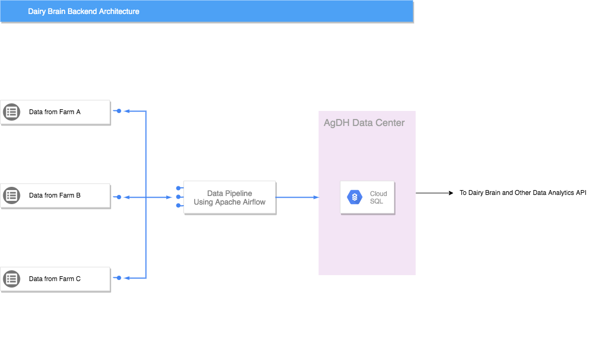
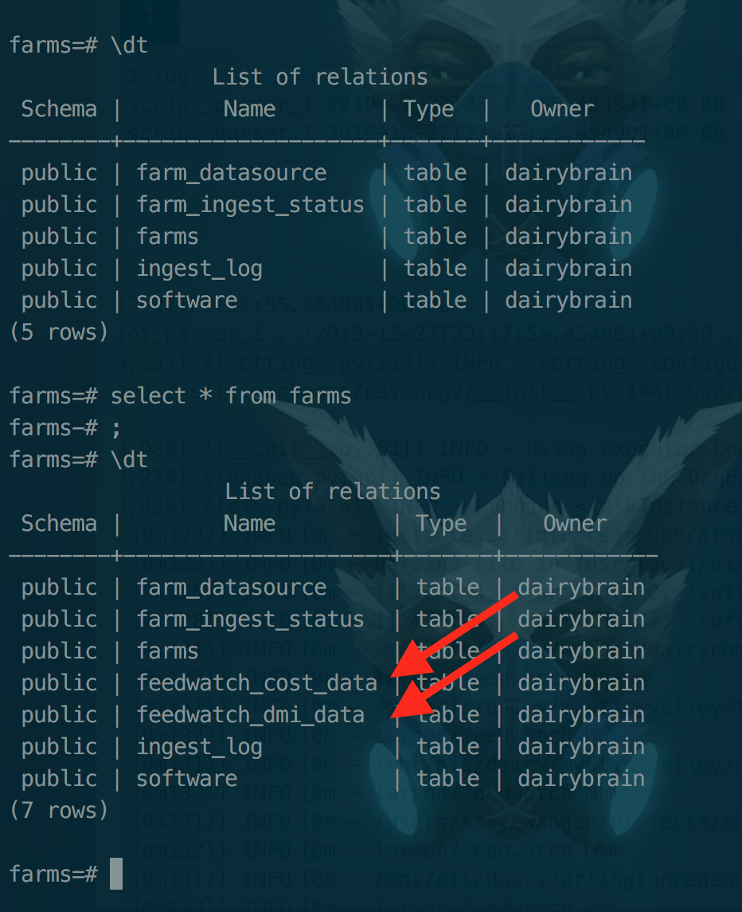
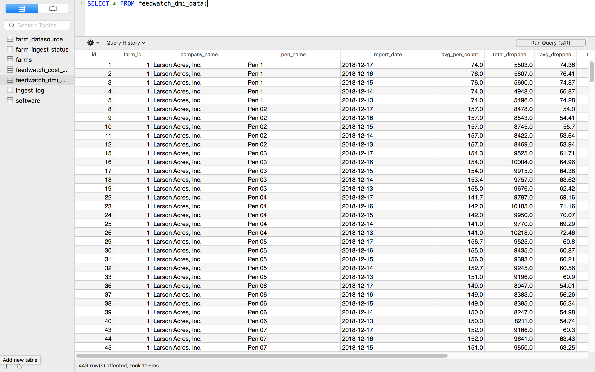
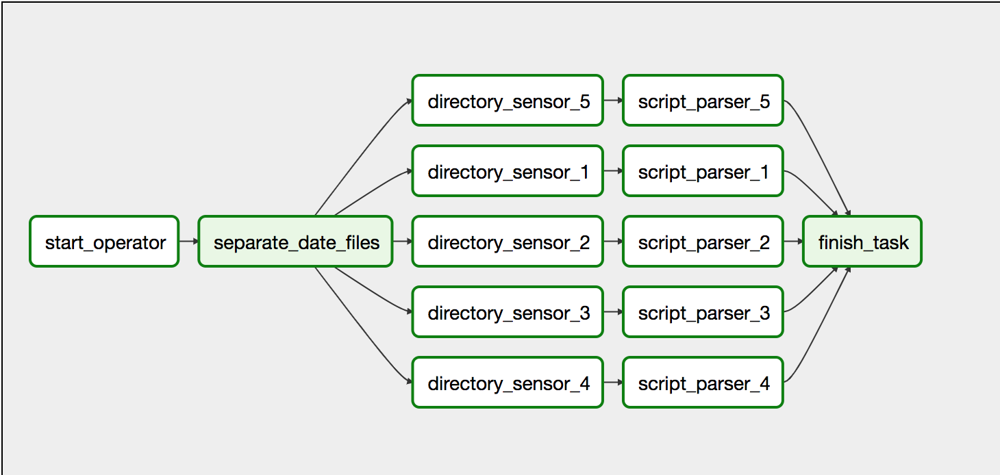

# Data Pipeline: from dairy farms to AgDH
This project is built based on an existing docker image for Apache Airflow. 
The original repository is here for reference: 
[Check this out](https://github.com/puckel/docker-airflow)

Initiator and Contributor: 
Oscar Zhang 
(GitHub: [OscarTHZhang](https://github.com/OscarTHZhang), Website: [Tianhe (Oscar) Zhang](https://oscarthzhang.github.io/))

## Content
* [Description](#Description) 
* [Usage](#Usage) 
* [Data-Script Mapping](#Data-and-Script-Mapping)
* [Remote Data Source Structure](#Remote-Data-Source-Structure)
* [Running Example](#Running-Example)
* [Implementation Details](#Implementation-Details)
* [Things Left to Do](#Things-Left-to-Do)

## Description
This project is proposed to be an interface between the data from dairy farms
and AgDH Data Center, which is the backend support for Dairy Brain and other analytics
APIs. See the illustration below: <br /><br />


The project will have pre-setup Directied Acyclic Graphs (DAGs) structure representing the pipelining tasks. Each DAG is associated with a specific data type in a farm. The DAG will be triggered manually and in the process it will sense the data files listed in the subdirectories containing the dates as the names, parse the data files using existing parsing scripts and store the data into the database. The DAG also try to run previously failed tasks if triggered.

## Usage
### Basic Setup
#### Clone the repository to your local environment
Run this command in your local terminal
```bash
$ git clone https://github.com/DairyBrain/data-pipeline
```
#### Create a new docker image from Dockerfile
First, make sure docker is installed on your local machine. 
If not or you're not familiar with Docker, refer to the [here](https://www.docker.com/get-started).
In the project directory on your local machine, run this command
```bash
$ docker build . -t <tag>:<label>
```
This example specifies that the PATH to the dockerfile is `.`, `<tag>` is the "name" for this image and `<label>` is default as "latest". You can then
use `$ docker images` to check if the image is created on your local machine. <br />

#### Modify Docker-Compose file to run the project 
In the docker compose file `docker-compose.yml`, change the image of webserver to whatever the label you created in the 
last step 
```bash
    webserver:
        image: cabello  # Change this line to the image <tag> you defined above
        restart: always
        depends_on: ...
        ...
```
Save the compose file and then run the project
```bash
$ docker-compose up
```
The Airflow web server is at `localhost:8080`
### PostgreSQL Setup
#### Configuration
Add a `config.py` file into `./plugins/operators` direcotry including the following information like this:
```python
db_password = "******" # database password
db_user = "******" # database user
db_host = "******" # host of the database
db_port = '******' # connection port
db_database = '******' # name of the database
db_dialect = 'postgresql' # should always be postgresql
```
The information should be varied if the database is set up on a local machine and should be relatively the same if connecting to a remote database server in WID.
#### Build from .sql dump file
Follow the [instructions](https://docs.google.com/document/d/17KATPtoOBHbVwZZ0HqmdPmrg-UV-6QlhttgVKIaiJ7Q/edit?usp=sharing)
to build the PostgreSQL database from `farmsdb_dump.sql` in the root of the project repository. This .sql file is dumped from my local machine, which is also used for
testing pipeline. You could contact [Steve Wangen](https://github.com/blue442) for the original database dump file. 
However, in that dump file, the `farm_datasource` table contains information that is mismatch with what [Andrew](https://dairybrain.wisc.edu/staff/maier-andrew/)
provided me. Therefore, I modified the database dumped from the original dump file so that the `file_location` column in `farm_datasource` table has a consistent format,
which is convenient for testing and production.

### Some Important Concepts
#### Volume mapping
The airflow dagbag is inside `/usr/airflow/` in the docker container. Before running the server, first map the `dag/` directory
in this project to the dagbag inside docker container; also remember to map `plugins/` and `test/` directries to the corresponding
directories in the container.

#### Dockerfile vs Docker-Compose
Dockerfile is for setting up the container structure. It is like a static configuration.
Whereas Docker-Compose is a setup for the running environment (image (static) -> container (running), such as volume mapping and port connections, 
of the image created by your Dockerfile.

#### Some useful commands
Here are some useful commands to check the container setup
```bash
# checking the running container name
$ docker ps

# access the running container file system
$ docker exec -it <container name> /bin/sh 
```

## Data and Script Mapping
By inspecting the database dump, the following mappings can be used for finding the correct script for given .csv data
* `dairycomp/` is ingested by `event_data_ingest.py`
* `tmrtracker` and `feedwatch` are ingested by `feed_data_ingest.py`	
* `agsource` is ingested by `agsource_data_ingest.py`
For `feed_data_ingest.py`, I have already incorporated in the project by making it from a bash program to a Python callable
function. The rest of the scripts can be found in [this repository](https://github.com/DairyBrain/ingest_scripts/tree/master/python).

## Remote Data Source Structure
Expected file structure
```bash
{farm_name}/{data_type}/{yyyy-mm-dd}/*.csv
```
Note that only *.csv files will be considered in the end.
Here are the existing file structure from the smb remote drive from [Andrew Maier](https://dairybrain.wisc.edu/staff/maier-andrew/).
Refer to him if you have any further question about this remote drive.
* arlington/agsource/, dairycomp/ -> {dates}/ -> .csv files
* haag/ -> (random structure, need to standarized, not my job)
* larson/ -> dairycomp/, extracts/, feedwatch/, grande/, smart_dairy/, smart_dairy2/ -> {dates}/ -> .csv files
* mystic_valley/ -> dairycomp/, grande/, tmrtracker/ -> {dates}/ -> .csv files
* uw-arlington/ -> feedsupervisor/ -> {dates}/ -> .csv files

## Running Example
I have made the example of data ingestion of `larson/feedwatch`. The data inside can be successfully fetched, pulled to 
DAG structures, parsed by the modified scripts, and store in the new tables in the database. This is considered as a 
success of one instance of the data sources. I am using a subset of the `larson/feedwatch` data, which is under `test/larson/feedwatch/`
in this project. The DAG file of this pipeline is `/dags/larson_feedwatch.py`. Here are some running demos. <br />
Figure 1: Creation of new tables in the farms database

<br>
<br>
Figure 2: Inside the `feedwatch_dmi_data` table

<br>
<br>
Figure 3: The DAG structure for this ingestion


## Implementation Details
This section contains descriptions for different operators inside `plugins/operators/my_operators.py` as well as the introduction of functionalities of nodes in the DAG using the above example as a reference.

### Self-defined Operators
#### `StartOperator` (inherits `airflow.models.BaseOperator`)
Running this operator means the DAG is on its starting process.
The task object instanciated by this class will access the database once to query for the data-script matching. This is 
very important because the later tasks in the DAG must know 
what script to use to parse the data they are receiving. It
also logs the starting information of the DAG such as the 
time that this DAG starts.

#### `DirectorySensor` (inherits `airflow.models.BaseOperator`)
Given a directory path, the task instanciated by this class will search for all the csv data files and store the file paths
to airflow's task instance for later use.

#### `ScriptParser` (inherits `airflow.models.BaseOperator`)
The task instanciated by this class will use the data-script mapping retrieved from the database from `StartOperator` as a logic to decide what parser to apply on the files received from the last task (task instanciated from `DirectorySensor` class) . The task will then call the parser directly.
* Raise `FileNotFoundError: Parsing directory may be wrong. Check DATA_SOURCE_DIRECTORY in the dag file!` when the file location from database is mismatch the file location provided in the DAG file.
* Raise `FileNotFoundError: No valid script found!` when no script is found from database.
* Raise `ValueError: No valid Farm ID!` when no valid farm id is found from database.

### Ingestion API
Inside `plugins/` I made some additions: `configs/`, which stores the configurations for all of the modules inside plugins, and `IngestAPI/`, which is a plugin that is not currently in used but possibly used in the future development. I also create a stand-alone repo for this API based on `configs/` and `IngestAPI/` and you can refer to [this repo](https://github.com/DairyBrain/ingestion-api) for detailed documentation.

### Tasks and Stages
Each DAG should have 5 stages separated by different tasks. <br/><br/>
The first stage is represented by 'star_operator' task. The functionality of this task is inside the `StartOperator` documentation. 
<br/><br/>
The second stage is represented by 'separate_date_files', which is defined by an `airflow.operators.dummy_operator.DummyOperator` as a preparation of separation of the tasks into different branches by the dates in directory names.
<br/><br/>
The third stage contains a list of tasks defined by `DirctorySensor` and will search for data files in different "dates" directories.
<br/><br/>
The forth stage is parsing. The parsing tasks are also separated by "dates" directories, so it makes sense that each 'directory_sensing' task is followed by a unique 'script_parsing' task.
<br/><br/>
The fifth/last stage is the finishing stage. The task on this stage will be triggered when all the previous tasks are done (regardless of success or failure).

### DAG Implementation and Thoughts
In the `dags/larson_feedwatch.py`, there is a line at the top:
```python
# This is the path that defines the place of data source. In the development phase, it is inside
# this folder path in the docker container
DATA_SOURCE_DIRECTORY = '/usr/local/airflow/test/larson/feedwatch'
# COULD CHANGE THE PATH FOR FURTHER DEVELOPMENT OR REAL-ENVIRONMENT TESTING
```
As the comment says, this is a hard-coded directory for testing purposes. In the future, if the data source location has been changed to remote, change this path as well. <br />
I personally think the ideal DAG implementation should be that each data type in a farm should have its unique dag, instead of dynamically creating new dags if there are new data types or new farms coming in. This makes sense because as there are new data sources, the database we rely on will also change and also there may be new ingest scripts adding into the repository. Therefore, making DAGs for 'farm/datatype' is my proposed solution right now.

## Things Left to Do
### Reassure the Name of Ingest Scripts / Modules
There are some name of the ingestion that need to be verified as they are not matched to what is in the database table
* event data ingestion (currently don't have the script matched to `event_data_ingest.py` in the ingest_scripts repository). Should it be `dairycomp_data_ingest.py`?
* agsource data ingestion (currently don't have the script matched to `agsource_data_ingest.py` in the ingest_scripts repository). Should it be `dhi_data_ingest.py`?
* milk data ingestion (currently don't have the matching data source in the remote drive)

### Dynamic Trigger Rule
The current functionality is: pipelining existing data files in a fixed directory. This need to be changed so that the DAG will be triggered dynamically, meaning whenever there are new 'date' folder coming in the DAG will run.
This could be achieved by modifying Operators or DAG files; need to be discussed further.

### Running Environment Setup
Currently I am testing the code on my local machine with PostgreSQL server on localhost and a local Docker container. The
project need to be brought up to a Unix runnning environment in WID building and connecting to a real WID PostgreSQL server.
